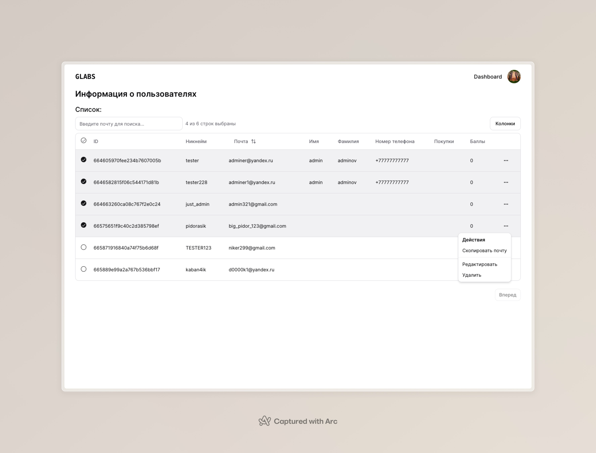

# Обновления

## 0.0.3

Добавлена возможность просмотра информации о текущих зарегистрированных пользователях проекта.
Вместе с этим добавлено:
- Таблица отображения данных (возможны разные исходные варианты)
- Поиск некоторых данных в таблице
- Сортировка данных в таблице
- Действия с данными в таблице (кнопка строки - ...)
- Выборка некоторых желанных строк из таблицы и работа с ними (в будущем)
- Просмотр только некоторых колонок по желанию (кнопка "Колонки" справа сверху)

Удален к сожалению не подходящий TanStack-Query (возможно дальнейшее возвращение при надобности)

Немного подправлен Profile Dropdown в Navbar компоненте 

